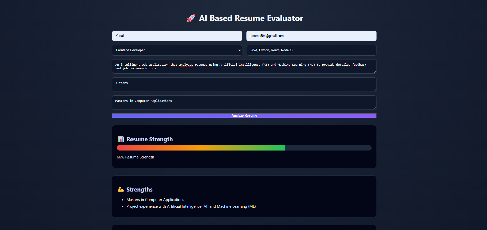
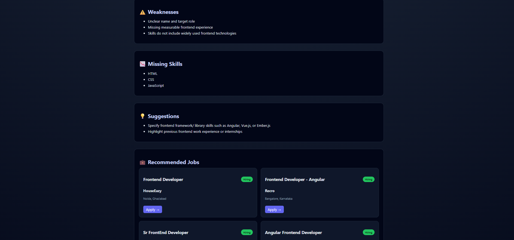

# 🚀 AI-Based Resume Evaluator

An intelligent web application that analyzes resumes using **Artificial Intelligence (AI)** and **Machine Learning (ML)** to provide detailed feedback and job recommendations.

---

## 📸 Project Preview

### 📝 Input Form



### 📊 Analysis Results



---

## 📌 Features

* 📊 Resume Strength Score (0–100)
* 💪 Strengths & Weakness Analysis
* 📉 Missing Skills Identification
* 💡 Personalized Suggestions
* 💼 Real-time Job Recommendations

---

## 🧠 How It Works

1. User enters resume details (skills, projects, experience, education)
2. Backend processes the data
3. Features are extracted for ML model
4. ML model predicts resume score
5. AI analyzes resume content for insights
6. Final score is calculated
7. Job listings are fetched via API
8. Results are displayed on UI

---

## 🛠️ Tech Stack

### Frontend

* HTML
* CSS
* JavaScript

### Backend

* Node.js (Express)

### AI Integration

* Groq API (LLM)

### Machine Learning

* Python
* scikit-learn (Decision Tree Regressor)

---

## 📊 Machine Learning Model

* Model: Decision Tree Regressor

* Features:

  * Skills (count)
  * Projects (count)
  * Experience (years)
  * Education Level (encoded)

* Evaluation Metric:

  * Mean Absolute Error (MAE): **~4.58**

👉 Interpretation: Predictions are on average **4–5 points away** from actual scores.

---

## 📁 Project Structure

```
AI-Resume-Evaluator/
│
├── public/
│   ├── index.html
│   ├── style.css
│   ├── script.js
│
├── server.js
├── predict.py
├── train_model.py
├── dataset.csv
├── README.md
├── .gitignore
```

---

## ⚠️ Dataset Note

* The dataset used is **synthetic (manually created)**
* Designed to simulate real-world hiring patterns
* Can be replaced with real datasets for production use

---

## 🔐 Environment Variables

Create a `.env` file in root:

```
GROQ_API_KEY=your_api_key
ADZUNA_APP_ID=your_app_id
ADZUNA_APP_KEY=your_app_key
```

---

## ▶️ Run Locally

### 1. Clone repository

```
git clone https://github.com/your-username/ai-resume-evaluator.git
cd ai-resume-evaluator
```

### 2. Install dependencies

```
npm install
```

### 3. Train model (optional)

```
python train_model.py
```

### 4. Start server

```
node server.js
```

### 5. Open in browser

```
http://localhost:3000
```

---

## 🔗 APIs Used

* Groq API (AI Analysis)
* Adzuna API (Job Listings)

---

## ⚙️ Key Concepts Used

* Feature Engineering
* Supervised Learning
* Decision Tree Regression
* MAE Evaluation
* API Integration
* Backend–Python Integration (child_process)

---

## 🚧 Limitations

* Small synthetic dataset
* Basic feature extraction
* AI response dependency
* Not production-ready

---

## 🚀 Future Improvements

* Use real-world resume datasets
* Apply NLP for resume parsing
* Improve model accuracy
* Add authentication system
* Enhance UI/UX

---

## 📌 Conclusion

This project demonstrates a complete pipeline integrating **AI + ML + Backend + Frontend** to evaluate resumes intelligently. It serves as a scalable foundation for real-world career assistance platforms.

---

## 📄 License

MIT License
